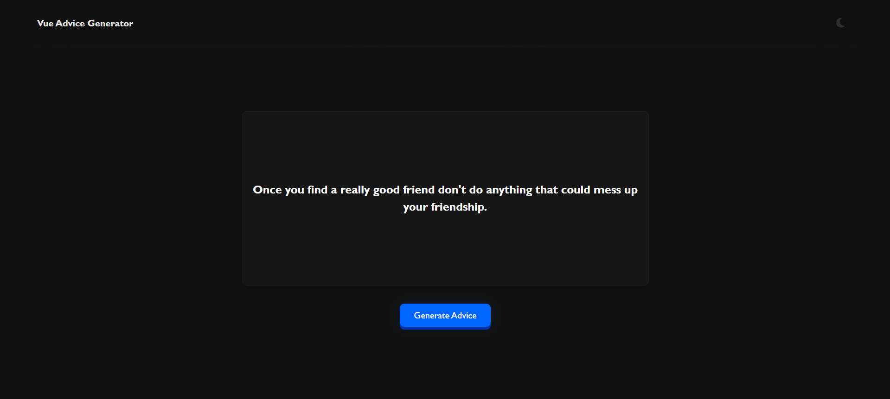

# Vue Advice Generator

This Vue app lets users toggle between light and dark themes while generating random advice from an external API. It detects the preferred color scheme, fetches advice on button click, and displays it dynamically. The clean UI and efficient component-based architecture ensure smooth functionality and a polished user experience.


## Example



## Project setup
```
npm install
```

### Compiles and hot-reloads for development
```
npm run start
```

### Compiles and minifies for production
```
npm run build
```
